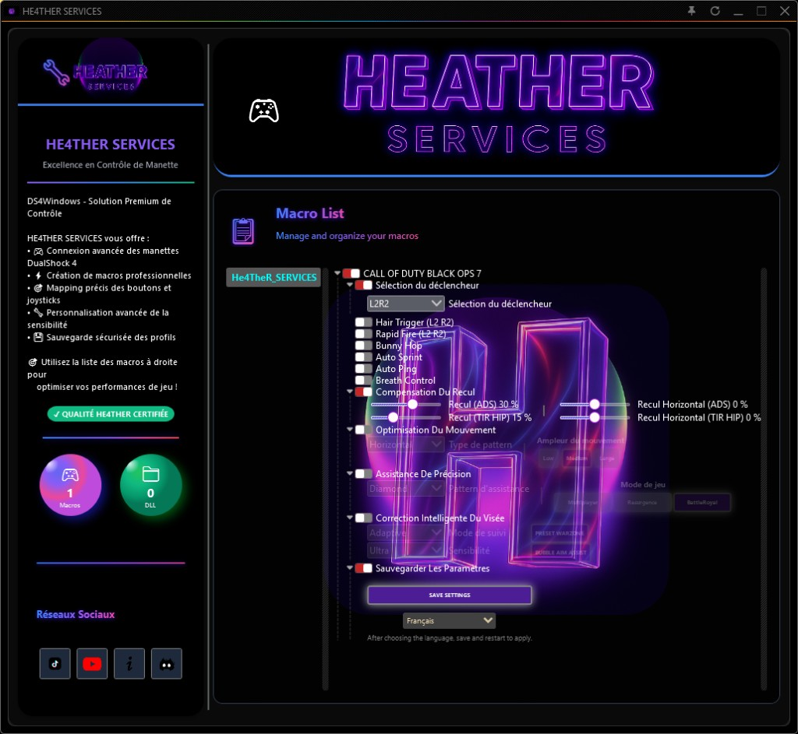

# HE4THER DS4 Windows HS

  

> **Advanced custom edition** of official **[DS4Windows](https://github.com/Ryochan7/DS4Windows)** — with an extra **macro window** built for FPS play.

**Stack:** C# · .NET · WPF

This is **not** stock DS4Windows.  
**HE4THER DS4 Windows HS** is a **much more pushed** custom build: same DS4Windows core, plus a dedicated macro UI designed for FPS-oriented controller macros, combos, and advanced input setups.

We **respect the original project** — credits, license, and upstream lineage stay front and center.

Looking for the lighter HE4THER package? → [HE4THER-DS4-Windows](https://github.com/He4TheR-Dev/HE4THER-DS4-Windows)

---

## What makes HS different

| | Classic DS4Windows | **HE4THER HS** |
|---|---|---|
| Controller → Xbox mapping | Yes | Yes |
| Base version | 3.3.3 | **3.3.3 custom** |
| Extra macro window | No | **Yes — FPS-focused macro panel** |
| Macro engine | — | `CustomMacroBase` + `CustomMacroFactory` |
| Extra UI layer | — | `DS4WinWPF.UI` |
| Advanced modules | — | OpenCV / OCR stack (optional heavy runtimes) |

Plug in DualShock / DualSense. Map like DS4Windows. Then open the **extra macro window** to build FPS macros the classic build never had.

---

## Features

- Full DS4Windows workflow (profiles, ViGEm Xbox pad, DS4/DualSense)
- **Dedicated macro window** for FPS games (rapid sequences, binds, advanced macro flows)
- HE4THER / HS packaging ready to run
- Profile included: `Profiles/PERFORMANCE.xml`
- Transparent credit to official DS4Windows authors

---

## Download

Get the full build as a **ZIP release** (recommended — the app is large):

**[Download HE4THER-DS4-Windows-HS-v3.3.3.zip](https://github.com/He4TheR-Dev/HE4THER-DS4-Windows-HS/releases/latest)**

This Git repo keeps docs / license light. The playable package ships on **Releases**.

## Quick start

1. Install **[ViGEmBus](https://github.com/ViGEm/ViGEmBus/releases)**
2. Install **[.NET Desktop Runtime](https://dotnet.microsoft.com/download/dotnet/8.0)** if prompted
3. Run `DS4Windows.exe`
4. Connect your controller
5. Open the **macro window** and set up your FPS macros
6. Load `PERFORMANCE` (or your own profile)

### Fair play note

Macros can violate some games’ Terms of Service — especially online competitive titles. Use responsibly on titles/modes that allow them. You are responsible for how you use this software.

---

## Large binaries (GitHub limit)

Some OCR / Paddle native files are **> 100 MB** and cannot live in a normal Git commit:

| File | Approx. size | Status in this repo |
|---|---|---|
| `runtimes/win-x64/native/paddle_inference_c.dll` | ~613 MB | Not included |
| `Sdcb.PaddleOCR.Models.LocalV3.dll` | ~132 MB | Not included |
| `Sdcb.PaddleOCR.Models.LocalV4.dll` | ~123 MB | Not included |

Core app + macro UI ship in this repository. If you need the full local OCR/Paddle stack, keep those files next to the build from your local HS package (or ask for a Release asset later).

---

## Respect for the original project

This is a **custom / advanced fork-style distribution** of official DS4Windows — not a claim of original ownership of the DS4Windows engine.

- Official upstream (archived, final **v3.3.3**): https://github.com/Ryochan7/DS4Windows  
- Earlier lineage: https://github.com/Jays2Kings/DS4Windows  
- Copyright notices from the binary include Scarlet.Crush Productions; InhexSTER, HecticSeptic, electrobrains; Jays2Kings; **Ryochan7**

Always treat **Ryochan7/DS4Windows** as the reference for the original software, source history, and community.

---

## License

**Copyright (c) 2026 HE4THER DEV (He4TheR-Dev)**

**GNU GPL v3.0** — aligned with late official DS4Windows releases.

See [LICENSE](LICENSE), [NOTICE](NOTICE), and [COPYRIGHT](COPYRIGHT).

---

## Credits

**DS4Windows** — Scarlet.Crush, Jays2Kings, Ryochan7 & contributors  
**ViGEm** — Nefarius & contributors  
**HE4THER HS edition** (macro window / advanced packaging) — Copyright (c) 2026 [HE4THER DEV](https://github.com/He4TheR-Dev)

---

  <b>Official DS4Windows core · HE4THER HS advanced cut</b> 
  Extra macro window. Built for FPS. Respect the original.

